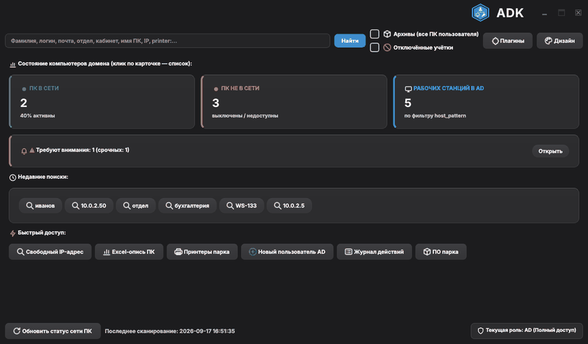
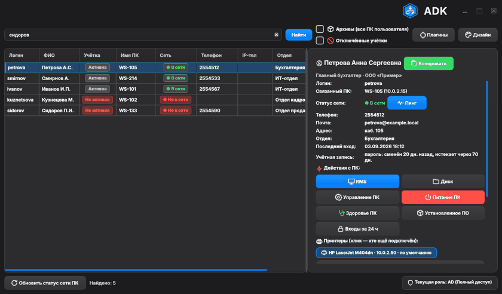
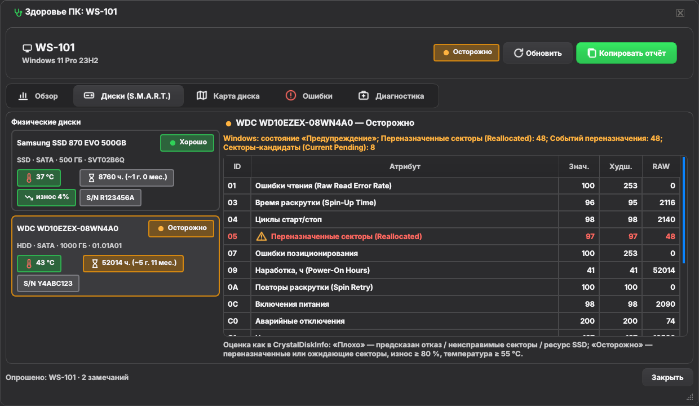
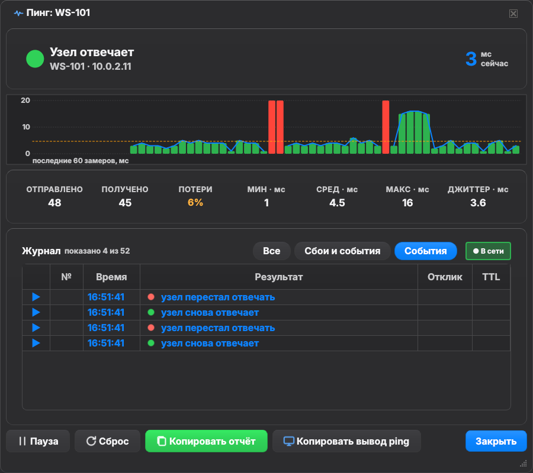
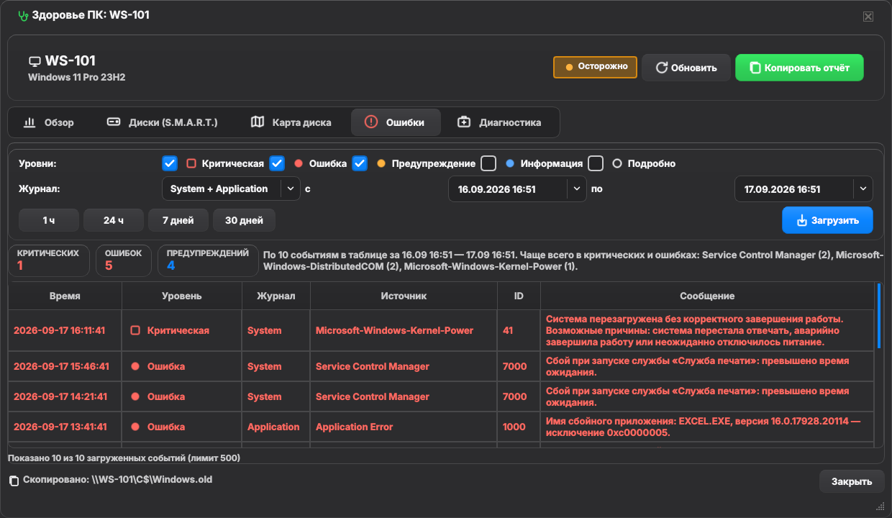

# ⚡ ADK — Active Directory Kit


  

**Набор инструментов системного администратора Active Directory в одном exe.**
Один запрос — и на экране сотрудник, его ПК, IP и статус сети, телефон, принтеры, здоровье ПК, заметки коллег
и кнопки удалённых действий. Вокруг поиска — инструменты для парка: массовые операции, сводка «Внимание»,
массовый пинг + WoL, установленное ПО, журнал действий, роли, плагины, CLI.

**Стек:** Python 3.10+ · PyQt6 · ldap3 · SQLite (или PostgreSQL). Windows-инструменты (PowerShell, DPAPI, RMS); ядро и тесты кроссплатформенные.

## 🎬 Как это выглядит

| Живой поиск → инспектор | Принтеры: клик по бейджу → кто подключён |
|---|---|
|  |  |

| Здоровье ПК: S.M.A.R.T. и карта диска | Пинг — монитор доступности | Журнал ошибок Windows |
|---|---|---|
|  |  |  |

Ещё GIF и 20+ снимков — в **[галерее](docs/SCREENSHOTS.md)**. Все снимки автоматические, данные синтетические (`example.local`).

## ✨ Что умеет

- **🔍 Единый поиск** — фамилия, логин, почта, отдел, **имя ПК или IP** (принтер по IP находится сам). Телефоны намеренно не ищутся.
- **🧭 Инспектор** — ПК, IP, живой статус сети, «Учётная запись» (блокировка, срок пароля), принтеры (снимок и **живой опрос**), заметки, история «кто сидел», действия: RMS, C$, `compmgmt`, перезагрузка, пинг, WoL.
- **🩺 Здоровье ПК** — обзор, **S.M.A.R.T.** (аналог CrystalDiskInfo), **карта диска** (аналог WinDirStat, только вручную), **журнал ошибок** с фильтром по уровням и сводкой за 24 ч.
- **👥 Карточка AD и регистрация** — атрибуты, группы, смена пароля (одно окно: пароль крупно, карточка для сотрудника), мастер нового пользователя с шаблонами.
- **🏢 Парк** — фоновый сканер, сводка «Внимание», массовый пинг + Wake-on-LAN, ПО и hotfix («у кого установлено 1С 8.3.22?»), входы 4624/4625, сравнение двух ПК, свободный IP **со сверкой с DHCP**, Excel-опись.
- **🧰 Массовые операции и экспорт** — Ctrl/Shift-выделение → группы, блокировки, пароли; XLSX/CSV.
- **🔒 Безопасность** — LDAPS, DPAPI/keyring, экранирование LDAP/SQL/имён узлов, журнал действий, роли по группам AD (право «ПК» и право «AD» независимо), диагностика — только чтение, копия БД перед миграцией.
- **🧩 Расширяемость** — плагины (`Action`-класс → кнопка), CLI (`adk --find … --json`), серверный режим с PostgreSQL, portable, ru/en, 10 тем (5 тёмных / 5 светлых) + свои цвета, иконки в стиле SF Symbols.

Полный список с деталями и горячими клавишами — **[docs/FEATURES.md](docs/FEATURES.md)**.

## 🚀 Быстрый старт

```bash
git clone https://github.com/AgentSharik/ADK.git && cd ADK
python -m venv .venv && .venv\Scripts\activate
pip install -r requirements.txt
python run.py
```

Первый запуск создаёт `Documents\ADK\config.ini` — заполните LDAP-параметры (образец `config.example.ini`) и запустите снова.
Готовый `ADK.exe` собирается одной командой `build_exe.bat`. Подробнее: **[установка, exe, роли, PostgreSQL, плагины](docs/INSTALL.md)**.

## 🧪 Качество

```bash
pyflakes adk tests
QT_QPA_PLATFORM=offscreen pytest -q          # 226 тестов
```

Плюс три сквозных сценария (172 проверки), CI на Python 3.11/3.12, короткий [отчёт о тестировании](docs/TEST_REPORT.pdf) (4 страницы, цифры берутся из логов).
Архитектура, структура модулей и правила работы с потоками — **[docs/DEVELOPMENT.md](docs/DEVELOPMENT.md)**.

## ⚠️ Ограничения

- Сканер, удалённые действия, здоровье ПК (WinRM/CIM), DHCP и хоткей — только Windows.
- SQLite — для 1–3 администраторов; для отдела — PostgreSQL + `adk --serve`.
- WoL и автоопределение MAC — в одном L2-сегменте; «Входы» требуют права читать журнал Security удалённо.
- Принтеры в таблице — из инвентарных CSV (снимок); актуальное состояние — кнопка «Опросить сейчас».

## 📜 История

Начиналось как внутренняя утилита-монолит, написанная за один отпуск. 2.0 — переработка по итогам аудита (модули, LDAPS, тесты).
2.1–2.2 — сброс пароля, журнал, принтеры, точный поиск. 3.0 — **ребрендинг в ADK** и набор инструментов.
3.1 — инструменты для парка, CLI, PostgreSQL. 3.2 — S.M.A.R.T. и карта диска; 3.2.1 — новое окно пинга, журнал ошибок, DHCP, живой опрос принтеров; 3.2.2 — карта подсети, опись с предпросмотром; 3.2.3 — единая лента пинга, свой выбор цвета, читаемые таблицы и карта диска; 3.2.4 — честный дашборд, принтер по IP без лишних строк; 3.2.5 — новая карточка пользователя, два состояния учётки, объёмная карта диска; 3.2.6 — честный пинг офлайн-ПК, карта диска без наложений; 3.2.7 — выбор тома для карты диска, карточка обновляется сама; 3.2.8 — живое ПО в сравнении ПК, таблицы карты диска справа; 3.2.9 — новое окно входа, «Диск» с выбором тома, честная вкладка «Почистить», пароль после разблокировки; 3.3.0 — меню «Питание ПК», роль «ПК» в карточке только на просмотр, надёжное сохранение пароля, вкладка «Диагностика»; 3.4.0 — исправления интерфейса: согласованные темы, контурные иконки в стиле SF Symbols, просторная карта подсети; 3.4.1 — полная проверка: исправлены логические, визуальные и функциональные баги, честные подписи дашборда, перекраска открытых окон при смене темы; 3.4.2 — читаемые темы и кнопки в духе macOS, крупные иконки, честная легенда карты подсети.
Подробно — [CHANGELOG.md](CHANGELOG.md).
